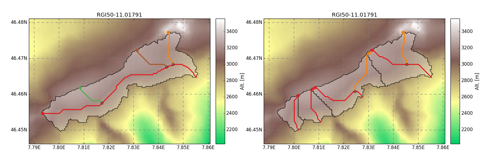

============
Partitioning
============

Many  glaciological applications(e.g `OGGM`_) uses glacier outlines provided by the `Randolph Glacier
Inventory`_ (RGI).
In some cases these outlines represent a "glacier complex" and not those of a single glacier.
This results in incorrect calculations, especially as the model is developed to handle glaciers individually.

Thus, a method seperating these complexes was developed by `Kienholz et al., (2013)`_. We have implemented this
method in the Python programming language and currently use `SAGA`_ and `GDAL`_ functions. Compared to the
described algorithm in `Kienholz et al., (2013)`_ , all used software packages are open source.

The workflow as well as the suggested parameter values persist unmodifed.

In contrast to the original method we have to do another step at the end. As the pygeoprocessing package is still in development,
we obtained overlapping flowsheds from the watershed calculation. Hence, in a last step we check whether the received
glaciers overlap. If the overlapping area is greater than 50 percent of one of the glaciers, then
they are merged together. Otherwise, we allocate the intersection area to the larger glacier. This
eliminates all overlaps.

Requirements
------------
software:

- Python 2.7 (caused by package dependencies)
- `GDAL`_
- `SAGA`_

Python packages:

- scipy
- numpy
- rasterio
- geopandas
- shapely
- skimage
- pygeoprocessing

Get the code
------------
The code of this project is available on GitHub. Clone the git repository::

    git clone https://github.com/OGGM/partitioning.git

Usage
-----

The required input data is glacier outline of a single glacier and a digital elevation model (DEM) with a resolution of 40 m.
Note, that you can use `OGGM`_ to prepare the shapefile and the DEM for each glacier using a valid `RGI`_ file.

First example - Python 2.7
~~~~~~~~~~~~~~~~~~~~~~~~~~~~~~~~~
You can run the algorithm with the following lines:

.. code-block:: python

    import os
    from partitioning.core import dividing_glaciers

    # set paths to the required input files
    shp = os.path.join('path to dir', 'outlines.shp')
    dem = os.path.join('path to dir', 'dem.tif')

    #run dividing algorithm
    n = dividing_glaciers(input_shp=shp, input_dem=dem)
    print 'number of divides:', n

This creates automatically a subdirectory for each divide, where a shapefile containing the outlines is located.

Second example - Python 3 and OGGM
~~~~~~~~~~~~~~~~~~~~~~~~~~~~~~~~~~
In a further example, we would like to show how to use the dividing algorithm together with `OGGM`_ in a Python 3 environment.
As we will run the dividing algorithm as an external program, you have to install a Python 2.7 version with the required packages (above).

We start with the usual first steps for OGGM:

.. code-block:: python

    import os
    from oggm import cfg, tasks, graphics, workflow
    from oggm.utils import get_demo_file
    import matplotlib.pyplot as plt
    import geopandas as gpd

    cfg.initialize()
    cfg.set_divides_db()
    cfg.PARAMS['use_multiprocessing'] = False
    # set dem resolution to 40 meters
    cfg.PARAMS['grid_dx_method'] = 'fixed'
    cfg.PARAMS['fixed_dx'] = 40
    cfg.PARAMS['border'] = 10

    entity = gpd.read_file(get_demo_file('Hintereisferner.shp'))
    hef = workflow.init_glacier_regions(entity, reset=False)[0]

    # get path to the input data
    input_shp = hef.get_filepath('outlines', div_id=0)
    input_dem = hef.get_filepath('dem', div_id=0)

We can use the get_filepath function to get the required input data. Next, we have to set the path to the Python 2.7 executable, where
the pygeoprocessing package, as well as all the other required packages are installed. We also need the path from the partitioning package
to call the dividing algortihm from the console.

.. code-block:: python

    # set paths to python 2.7 and to the partitioning package
    python = 'path to python 2.7'
    project = 'path to the partitioning package'

    script = os.path.join(project, 'partitioning/run_divides.py')

    # run code from your console (PYTHON 2.7!)
    os.system(python + ' ' + script + ' ' + input_shp + ' ' + input_dem)

    print('Hintereisferner is divided into', hef.n_divides, 'parts.')

With the following lines OGGM compute the centerlines and plot the result.

.. code-block:: python

    tasks.glacier_masks(hef)
    tasks.compute_centerlines(hef)
    graphics.plot_centerlines(hef)
    plt.show()

.. _OGGM: http://oggm.readthedocs.io/en/latest/
.. _RGI: http://www.glims.org/RGI/
.. _Randolph Glacier Inventory: http://www.ingentaconnect.com/content/igsoc/jog/2014/00000060/00000221/art00012
.. _Kienholz et al., (2013): http://www.ingentaconnect.com/contentone/igsoc/jog/2013/00000059/00000217/art00011
.. _SAGA: http://www.saga-gis.org/en/index.html
.. _GDAL: http://www.gdal.org/